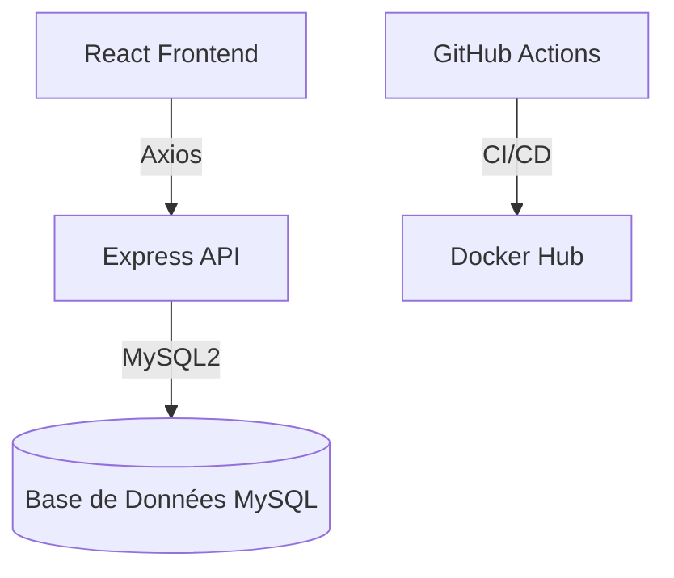

# 📘 Documentation du Projet Fullstack avec CI/CD

---

## 1. 📌 Présentation Générale
Ce projet est une application **fullstack** développée avec :

- **Backend** : Node.js (Express) + MySQL  
- **Frontend** : React.js  
- **Infrastructure** : Docker + Docker Compose  
- **CI/CD** : GitHub Actions

Elle permet la gestion d’utilisateurs avec un système **CRUD** complet, des **tests automatisés**, et une **pipeline CI/CD fonctionnelle**.

---

## 2. 🏗️ Architecture Technique

### 2.1 Structure des Fichiers

**Backend** (`/backend`)  
• `Dockerfile` – Configuration du conteneur  
• `server.js` – Point d’entrée du serveur  
• `user.test.js` – Tests unitaires  
• `.env` – Variables d’environnement  

**Frontend** (`/frontend`)  
• `Dockerfile` – Build de production  
• `index.js` – Fichier racine React  
• `nginx.conf` – Config NGINX  

**Racine**  
• `docker-compose.yml` – Orchestration  
• `.github/workflows/ci.yml` – Pipeline GitHub Actions  
• `.gitignore`

---

### 2.2 🧬 Schéma d'Architecture


---

## 3. ⚙️ Configuration Requise

### 3.1 🔧 Prérequis
- Docker ≥ 20.x  
- Node.js ≥ 18.x  
- Git

### 3.2 🔐 Variables d’Environnement (`.env`)
```env
DB_HOST=mysql
DB_USER=root
DB_PASSWORD=nouveaupass
DB_NAME=fullstack_db
DB_PORT=3306
```

---

## 4. 🚀 Installation et Exécution

### 4.1 🧪 Développement Local
```bash
# Lancer les conteneurs
docker-compose up --build
```

- Frontend : [http://localhost:3000](http://localhost:3000)  
- Backend : [http://localhost:5000/api/users](http://localhost:5000/api/users)

---

## 5. 🧪 Tests Automatisés

### 5.1 ✅ Tests backend
| Type        | Outils        |
|-------------|---------------|
| Unitaire    | Mocha / Chai  |

### 5.2 ▶️ Lancer les tests
```bash
docker exec -it <backend-container> npm test
```

---

## 6. 🔁 Pipeline CI/CD

### 6.1 ⚙️ GitHub Actions
Le workflow est défini dans `.github/workflows/ci.yml`.

```yaml
name: CI/CD
on: [push]
jobs:
  test:
    runs-on: ubuntu-latest
    services:
      mysql:
        image: mysql:8.0
        env:
          MYSQL_ROOT_PASSWORD: root
          MYSQL_DATABASE: testdb
    steps:
      - uses: actions/checkout@v4
      - run: npm ci && npm test

  deploy:
    needs: test
    steps:
      - uses: docker/build-push-action@v4
        with:
          push: true
          tags: ismaillaa/fullstack:latest
```

---

## 7. 🧠 Décisions Techniques

### 7.1 🧱 Choix Architecturaux
- Frontend/Backend séparés et dockerisés  
- Multi-stage build pour React  
- Variables d’environnement sécurisées avec `.env`

### 7.2 ⚡ Optimisations
- Docker volume pour la BDD  
- Tests indépendants de la base locale  
- Gestion d’erreurs centralisée

---

## 8. ☁️ Déploiement

### 8.1 🔨 Build & Push Docker
```bash
# Build des images
docker-compose build

# Push (si configuré avec Docker Hub)
docker-compose push
```

---

## 🔗 Liens

- [📁 Repo GitHub](https://github.com/ismaillaa/fullstack-app)
- [🐳 Docker Hub](https://hub.docker.com/u/ismaillaa)
